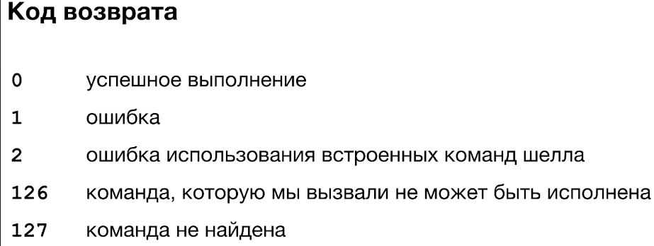
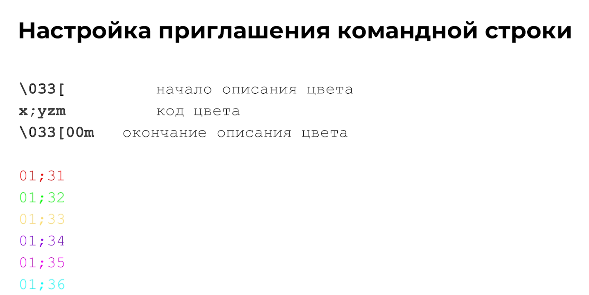
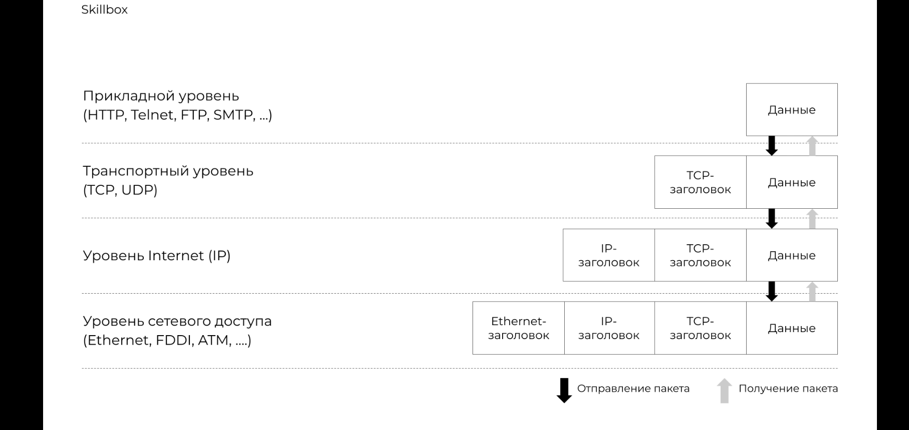

# DevOps

## Страницы

Настройка ZSH окружения Linux -
 <https://www.linuxfordevices.com/tutorials/linux/make-arch-terminal-awesome>

---

[Proxmox](Proxmox.md)

---



[Автоматическая регистрация имён хостов в DNS на MikroTik](https://onformix.blogspot.com/2017/01/autoreg-dns-mikrotik.html)

Полезная статья по автоматическому созданию статической DNS записи

---

Настройка fail2ban для защиты sshd

[Как установить Fail2ban для защиты SSH на CentOS / RHEL 8](https://blog.sedicomm.com/2019/10/23/kak-ustanovit-fail2ban-dlya-zashhity-ssh-na-centos-rhel-8/)

---

Импорт публичного ключа на сервер

[SSH авторизация по ключам. PuTTy | Блоговик](https://www.artur.lv/ssh-avtorizatsiya-po-klyucham-putty/)

---

Установка Webmin на CentOS 8

[How to Install Webmin on CentOS 8](https://linuxize.com/post/how-to-install-webmin-on-centos-8/)

---

Создание сертификата Let’s encrypt в apache CentOS

[Создание сертификата Let’s Encrypt для Apache в CentOS 7](https://www.8host.com/blog/sozdanie-sertifikata-lets-encrypt-dlya-apache-v-centos-7/)

## Пользователи и VIM

### VIM

W - переместиться на начало слова
E  - переместиться на конец слова

B - переместить курсор в начало слова c конца

### Пользователи

При выводе файла /etc/passwd мы получаем примерно вот такой вывод в командную строку.


### Пользователь в Linux состоит из таких частей


Пользователь с uid 0:0 имеет неограниченные права на систему(удаление, изменение, добавление)

### Создание пользователя

Создать пользователя мы можем при помощи команды useradd

Пример команды

```bash
useradd username -b /home/username -c "Username Usernameov" -g userfroup -p password

Или же

adduser username
```

Команда является не интерактивной, т.е при создании пользователя не будет создана домашняя директория, пользователь не будет добавлен в группу  а так же  не будет задан пароль.
Для интерактивного создания пользователя используется **adduser.**

### Редактирование пользователя

Для редактирования атрибутов пользователя используется команда usermod
Команда не является интерактивной, поэтому для изменения атрибутов нужно использовать дополнительные ключи.

Пример


### Файл с паролями

Файл с паролями находится по пути /etc/shadow

Доступ на чтение к нему имеет только root

Структура файла выглядит так


Структура записи в файл выглядит таким образом


### Смена пароля

Для смены пароля используется утилита passwd.

```bash
passwd username
```

### Флаги доступа

- SUID
- SGID
- Sticky-bit

### SUID

Запуск файла с теми правами, которые есть у владельца файла, а не у пользователя, который его запускает.

```bash
chmod u+s file
```

### SGID

- Запуск файла с теми правами, которые есть у группы владельца файла, а не у группы пользователя, который его запускает
- Группа-владелец созданных в каталоге файлов — группа владельца директории, а не группа, которой принадлежит пользователь, создавший файл.

```bash
chmod g+s dir - используется для каталогов
```

### Sticky-bit

Файл в директории может удалить только тот, кто этот файл создал.

```bash
chmod +t dir - даёт права на удаление только создателю директории.
```

Материал по данной теме
<https://losst.pro/prava-dostupa-k-fajlam-v-linux?ysclid=ly5u254la660647224>

### Права доступа

В Linux можно назначать права доступа цифрами
Чтение - 4

Запись - 2

Исполнение - 1

Пример назначения прав доступа выглядит так

```bash
sudo chmod 777 example.txt
```

Где первая 7 означает владелец, вторая 7 означает группа, а третья 7 означает остальных пользователей.

### Группы пользователей

Файл групп выглядит так


Формат записи группы выглядит таким образом


### Создание группы

Для создания группы используется следующая команда

```bash
groupadd groupname
```


## Подключение при помощи ключа SSH

- Генерируем ключевую пару ssh-keygen -t ed25519 -C “comment”, где ssh-keygen это исполняемый файл, который генерирует ключи. -t ED25519 - это тип ключа. -C “comment”  - добавляет комментарий к ключу.
- Копируем открытый ключ на сервер: ssh-copy-id -i “key.pub” user@server
- Подключаемся к серверу ssh user@server

### Копирование файлов через SSH

Копирование осуществляется через SSH при помощи команды scp.

Пример использования scp <опции> user1@server2:<путь до файла> user2@server2:<путь до файла>

Опция -r позволяет копировать целые папки

Дополнительные примеры:

- scp user@server:/tmp/1.txt /home/example — Это копирование с сервера к себе на машину
- scp /home/example/1.txt user@server:/tmp — Это копирование на удаленный сервер.

## Мониторинг

### Команды

Краткое имя сервера - hostname

Полное имя - hostname -f

Узнать версию OS - cat /etc/os-release

Узнать версию ядра - uname -r

Модель процессора - cat /proc/cpiuinfo | less

Объем памяти - free -h | старый способ - sudo dmesg | grep Memory\:

Дисковые устройства - lsblk —fs; lsblk -o NAME, SIZE, FSTYPE, FSSIZE, FSUSED, MOUNTPOINT, PARTTYPENAME

Точки монтирования - cat /etc/fstab

Свободное место на диске - df -h

Сетевые интерфейсы:

- ip link show
- ifconfig
- sudo lshw -class network -short
- ip -br address show
- netstat -rn
- ip route show
- cat /etc/resolv.conf

Настройки времени - date; ls -l /etc/localtime; timedatectl

Вся линейка утилит ls*


### Производительность

Процессор и память

- openssl speed -evp md5 -multi N
- sysbench cpu run —threads=n —time=60
- sysbench memory run —threads=N —time=60

Диски

Скорость записи:

dd if=/dev/zero of /tmp/test1.img bs=256M count=20 oflag-dsync

Скорость чтения

time dd if=/path/to/file of=/dev/null ms=8k

### Uptime

uptime или w


Смотрим список процессов - ps -ef

Смотрим дочерние процессы - pstree -p <PID> PID - ID процесса.


## Процессы и перенаправление вывода

Убить процесс

```bash
kill "pid" 
```

Преобразование вывода

**Команда cut — это команда выборки отдельных полей из строк файла.**

Она используется для выборки колонок из таблицы или полей из каждой строки файла. Если применить терминологию баз данных, команда cut выполняет операцию проекции отношения.

<https://losst.pro/komanda-cut-linux?ysclid=ly5jxs4ib2795871247>

```bash
cut опции путь_к_файлу
```

**Команда** **tr** - это утилита командной строки UNIX для перевода или удаления символов. Она поддерживает ряд преобразований, включая преобразование верхнего регистра в нижний, сжатие повторяющихся символов, удаление определенных символов и базовый поиск и замену.

<https://losst.pro/komanda-tr-v-linux?ysclid=ly5jvjn3ds742307682>

```bash
tr [КЛЮЧ]... НАБОР1 [НАБОР2]
```

<https://losst.pro/komanda-xargs-linux?ysclid=ly5juzw62w597349948>

**xargs — утилита для формирования списка аргументов и выполнения команды в UNIX-подобных операционных системах.**

```bash
первая_команда | xargs опции вторая_команда аргументы
```

**Cat** (от англ. concatenate) — **утилита UNIX, выводящая последовательно указанные файлы (или устройства), объединяя их в единый поток.**

Если вместо имени файла указывается «-», то читается стандартный ввод.

**Может использоваться в следующих случаях:**

1. Когда требуется вывести куда-то файл без изменений.
2. Когда требуется объединить более одного файла (например, части одного файла, разбитого командой split), либо файл(ы) с потоком стандартного ввода.
3. Когда требуется просмотреть содержимое файла.

<https://losst.pro/komanda-cat-linux?ysclid=ly5k0de324112823541>

```bash
cat опции файл1 файл2 ...
```

Команда **du** (Disk Usage, т.е. использование диска) – это стандартная команда Unix/Linux, используется для показа суммарной информации об использовании диска файлами и директориями.

<https://losst.pro/komanda-du-v-linux?ysclid=ly5lix5244130731945>

```bash
du опции /путь/к/папке

du -h - будет показывать размерность файла(МБайт, КБайт)
```

### Стандартные потоки

- Команда xargs превращает строку, полученную на стандартный ввод в аргументы и передаёт их команде.
- Операторы перенаправления вывода:  >, >>.
- Пайп позволяет передать стандартный вывод одной команды на стандартный ввод другой.

#### STDIN  —  ввод  —  0

#### STDOUT  — вывод  —  1

#### STDERR  —  ошибки  —  2


### Фоновые процессы и полезные команды

declare используется для создания переменной

unset для удаления переменной

declare с ключом -r используется для создания константы

```bash
declare -r 
```

alias позволяет посмотреть список всех доступных алиасов в системе (алиас присваивается для упрощения работы с командой - например ps -auxf сокращается до pss по средствам выполнения команды

```bash
alias pss “ps -auxf”
```

Для выполнения команды в фоновом режиме достаточно добавить в конце команды символ &
<https://losst.pro/kak-zapustit-protsess-v-fone-linux?ysclid=lz8gg59p44543443975>

Команда jobs показывает все фоновые задачи

bg **номер процесса*  -* переводит процесс в фоновые режим

fg - выводит процесс из фона

Перенаправление вывода команды в пустоту

```bash
*команда* напрмер
traceroute ya.ru &> /dev/null
```

После этого мы можем посмотреть код возврата командой echo $?


## Планировщик задач Cron

**Cron** позволяет запуcкать команды/скрипты по рассписанию.


## Скрипты

Написание скрипта начинается вот с такой строчки

<https://losst.pro/napisanie-skriptov-na-bash?ysclid=ly6usffegc342352856>

```bash
#! /bin/bash
```

Обозначение переменной в Bash


Принцип определения исполняемого файла


Специальный параметр


### Исполнение скрипта без указания ./ в определенной директории

Для того скрипт выполнялся без указания директории ./ необходимо добавить нужную нам директорию в $PATH. Для этого мы выполним следующие действия.

1. Убедиться что скрипт имеет право на исполнение. Для этого используйте команду chmod

```bash
chmod +x my_scripth.sh
```

1. Добавляем нужную нам директорию в переменную окружения PATH. Для этого откройте файл конфигурации вашего shell ( обычно это .bashrc или .bash_profile) и добавьте в конце строчку

```bash
export PATH=$PATH:"/home/%user%/scripts"
```

1. Примените изменения

```bash
source ~./bashrc
```

После этого у вас появляется возможность запускать скрипты без указания ./  в директории, которую вы указали в переменной PATH.


Для переноса директории содержащей пробелы скриптом, требуется переменную в скрипте заключить в двойные кавычки - “”

#### Условный оператор if

В Bash условный оператор if записывается следующим образом

```bash
if [ a = b ]
 then
 echo "A = B"
 else
 echo "A do not match B"
fi
```

#### Арифметические операции

[Арифметические операции в Bash скрипте](https://devhops.ru/linux/bash/arithmetics.php)


let - это встроенная функция bash, которая позволяет производить базовые арифметические операции.

Команда не умеет выводить результат на стандартный вывод.

```bash
let <арифметическая операция>
```

expr - похож на **let** за исключением того, что вместо сохранения результата в переменную **expr** по умолчанию печатает ответ.

Но никто не запрещает сохранять результат **expr** в переменные с помощью command substitution: **x = $(expr 2 + 2).** В отличие

от **let** не нужно заключать выражения с пробелами в кавычки.

Нужно ставить пробелы вокруг операторов.

##### Оператор выбора

[Командная строка Linux | Конструкция case (metanit.com)](https://metanit.com/os/linux/12.9.php?ysclid=lzmirwcymr695353212)

Конструкция **case** позволяет сопоставить некоторое выражение (например, переменную) с рядом значений. И если сравниваемое выражение равно определенному значению, то выполнить некоторый набор команд. Общий синтаксис конструкции:

```jsx
case "$перменная" in
"вариант1" ) команда;;
"вариант2" ) команда;;
*)
esac
```

#### Цикл While

Тело цикла While выглядит следующим образом

```bash

while [CONDITION]
do
  [COMMANDS]
done
```

[Цикл while в Bash - Команды Linux](https://routerus.com/bash-while-loop/)

#### Until

Цикл « `until` используется для выполнения заданного набора команд до тех пор, пока данное условие оценивается как ложное.

Цикл Bash `until` принимает следующую форму:

```bash
until [CONDITION]
do
  [COMMANDS]
done
```

#### Настройки приглашения командной строки

[ZENCOD.ru](https://zencod.ru/articles/prompt-string-bash/)



**Ctrl + R - поиск по истории вводимых команд в shell linux.**

#### Способ передачи многострочного текста в команду

[Bash Heredoc](https://linuxize.com/post/bash-heredoc/)


#### Функции

Синтаксис создания функции очень прост:

```bash
**имя_функции() { список_команд }**
```

Имя функции не должно совпадать ни с одной из существующих команд или функций, а все команды в теле функции пишутся с новой строки.

[Функции bash в скриптах - Losst](https://losst.pro/funktsii-bash-v-skriptah)

#### Архивация

По умолчанию в системах Unix/Linux включен встроенный архиватор tar, позволяющий запаковывать/распаковывать архив и выполнять много других операций с заархивированными файлами. В его функционал не входит компрессия, но он отлично работает с такими утилитами, как Gzip и BZip2 – с помощью них и выполняется сжатие файлов.

[Команда tar: архивация, распаковка и сжатие файлов в Linux](https://timeweb.com/ru/community/articles/komanda-tar-arhivaciya-raspakovka-i-szhatie-faylov-v-linux)

#### AWK

Команда awk - один из самых мощных инструментов для обработки и фильтрации текста, доступный даже для людей никак не связных с программированием. Это не просто утилита, а целый язык разработанный для обработки и извлечения данных. В этой статье мы разберемся как пользоваться awk.

[Использование awk в Linux](https://losst.pro/ispolzovanie-awk-v-linux)


#### SED

Команда sed - это потоковый редактор текста, работающий по принципу замены. Его можно использовать для поиска, вставки, замены и удаления фрагментов в файле. С помощью этой утилиты вы можете редактировать файлы не открывая их. Будет намного быстрее если вы напишите что и на что надо заменить, чем вы будете открывать редактор vi, искать нужную строку и вручную всё заменять.

[](https://losst.pro/komanda-sed-linux)


#### Best Practices

## IP, DNS


traceroute - программа, которая показывает, какой путь проходит пакет, прежде чем достичь конечный хост.

mtr - расширение для traceroute, которое помимо этого еще и пингует хосты и показывает задержку до этих хостов.


## WWW

### HTTP

[Простым языком об HTTP](https://habr.com/ru/articles/215117/)


## Системы инициализации

[](https://losst.pro/sistemy-initsializatsii-linux)

Системы инициализации Linux

[Глава 9. Сервисы Unix](https://l.github.io/debian-handbook/html/ru-RU/unix-services.html)

[Systemd за пять минут](https://habr.com/ru/companies/slurm/articles/255845/)


### Systemd

### Основные виды юнитов


## Symlink и hardlink

[Символические и жесткие ссылки Linux - Losst](https://losst.pro/simvolicheskie-i-zhestkie-ssylki-linux)

## Каталог /dev

[Команда mknod](https://linux-faq.ru/page/komanda-mknod)

[Подключенные устройства Linux - Losst](https://losst.pro/podklyuchennye-ustrojstva-linux?ysclid=m0usb48c47724582123)

[How to Create Block Device Files Using mknod Command](https://www.tecmint.com/mknod-command/)

## Монтирование файловой системы

[Монтирование диска в Linux - Losst](https://losst.pro/montirovanie-diska-v-linux?ysclid=m0usp3iemx999697633)


13 - Разметка диска

## Разметка диска

[Команда fdisk в Linux - Losst](https://losst.pro/komanda-fdisk-v-linux?ysclid=m0v0g7b4ti827967170)

[Автоматическое монтирование fstab и systemd - Losst](https://losst.pro/avtomaticheskoe-montirovanie-fstab-i-systemd?ysclid=m0v0ik3kcc175320115)

На данном скриншоте показано, как монтируется добавленый диск


## Реляционные базы данных


### Типы данных MySQL


### DML, DDL, Transaction


### Транзакции

#### ACID - свойства

[ACID. Что под капотом у транзакции](https://habr.com/ru/companies/simbirsoft/articles/572540/)

- Атомарность
- Согласованность
- Изолированность
- Прочность

1. **Атомарность** гарантирует, что транзакция не может выполниться частично
2. **Согласованность** требует, чтобы после завершения транзакции данные оставались консистентными и валидными.
3. **Изолированность** требует, чтобы при параллельном выполнении транзакции не влияли друг на друга.
4. **Прочность** гарантирует, что, если пользователь получил подтверждение, что транзакция выполнена, изменения не будут отменены из за какого-либо сбоя.

#### Base - свойства

- Базовая доступность (Basically available)
- Мягкое состояние (Soft state)
- Согласованность в конечном счёте (Eventual consistenct)

## Не реляционные базы данных

### CAP - Теорема

Для любой реализации распределенных вычислений возможно обеспечить не более двух из трёх следующих свойств.

- Согласованность (Consistency)
- Доступность (Availability)
- Устойчивость к разделению (Partition tolerance)

### Основные виды моделей организаций данных

- Иерархическая модель
- Сетевая модель
- Реляционная модель
- Не реляционная модель

## Резервное копирование

### Виды резервного копирования

### Создание Backup базы данныз

- Полное резервное копирование
- Дифференциальное резервное копирование
- Инкрементальное резервное копирование

Создание бэкапа базы данных MySQL происходит следующим образом

```jsx
sudo mysqldump -u root mydb > /tmp/dump.sql
```

Данная команда позволяет выполнить бэкап базы в виде её дампа.
Так же мы можем заархивировать бэкап после его создания.
Для этого используем следующую команду

```jsx
sudo mysqldump -u root -p *Password* mydb | gzip > /tmp/dump.sql
```

## TCP/IP



### Канальный уровень

Типы передачи данных

- Unicast
- Multicast
- Broadcast


### Сетевой уровень

Схема IP пакета


Маска подсети


### Частные диапозоны


### Транспортный уровень


[def]: Proxmox
